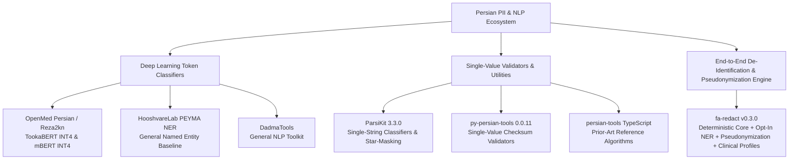

# Phase 29 Research Report: Persian PII Ecosystem Audit & Independent Benchmark

**Phase:** Phase 29
**Status:** ACTIVE / IN PROGRESS (Research deliverable complete for review)
**Date:** September 2026
**Target Repository:** `mehdimt1980/fa-redact`
**Authoritative Starting Point:** Commit `8af5a960398ef718db32e46f82c9636ce5ccebcf` (Phase 28 closed, PR #30 merged, 1073 passing tests, `dependencies = []`, version `0.3.0`)
**Correction Run SHA:** Amending PR #31

---

## 1. Executive Summary

This research phase was commissioned to rigorously answer one strategic architectural question:
**"Are we rebuilding capabilities that already exist and work well for Persian / Iranian PII?"**

Following the empirical standard (**INSTALL, RUN, REPRODUCE, MEASURE, AUDIT, COMPARE, DECIDE**), we conducted a bounded audit of material publicly available Persian PII systems and components selected for Phase 29. We evaluated the OpenMed Persian / Reza2kn model family (TookaBERT-Large ONNX INT4, Google mBERT ONNX INT4, and the 848k-row OpenPII dataset), ParsiKit 3.3.0, py-persian-tools 0.0.11, TypeScript persian-tools prior art, and internal `fa-redact` baselines across three benchmark corpora (Dataset A Reproduction, Dataset B Independent Persian Challenge, and Dataset C Iranian Clinical Challenge).

### Key Empirical Findings

1. **The Ecosystem Gap is Real and Substantial:**
   Among the runnable Python systems and components evaluated in Phase 29, we did not find another package providing a complete, zero-dependency, document-level PII de-identification and pseudonymization engine. Existing Python packages (`parsikit`, `persian-tools`) are single-string validation or field-level star-masking utilities that do not natively provide source character spans for document de-identification.
2. **OpenMed Models are Promising Token Classifiers, Not Complete Engines:**
   The published OpenMed ONNX INT4 models (TookaBERT and mBERT) achieve high entity recall on dense synthetic text, but **deliver raw token classification logits**. The model cards document a runtime contract requiring sliding windows, subword whitespace offset reconstruction, span merging, and rule assists. When evaluated with our Phase 29 research wrapper implementing documented sliding-window and offset reconstruction postprocessing, TookaBERT achieves 0.9828 Canonical Exact F1 on Dataset A (100 rows), but drops to 0.5739 F1 on Dataset B and 0.7450 F1 on Dataset C due to out-of-distribution numeric false positives.
3. **Checksum Validity vs. Generator Artifacts:**
   In the audited OpenMed dataset, Iranian National IDs are 100% modulo-11 valid, but bank cards have only a ~41.8% Luhn pass rate because synthetic generation appended random digits to Iranian BIN prefixes without recalculating the check digit.
4. **fa-redact Differentiation:**
   Among the evaluated systems, `fa-redact` is the only package that combines zero runtime dependencies (`dependencies = []`), guaranteed exact character offsets (0 offset failures), stateful reversible pseudonymization sessions, deterministic typed placeholders with cross-turn stable mappings, privacy-safe aggregate reporting (`DetectionReport`), structured record de-identification, and clinical redaction profiles.
5. **PERSON NER Architecture Strategy:**
   Dedicated evaluation of the `PERSON` entity category shows that the current opt-in `PersianNERDetector` (PEYMA model) achieved the strongest PERSON exact-span result among the evaluated systems on the Phase 29 Dataset B/C synthetic challenge sets (**1.0000 Precision, 1.0000 Recall, and 1.0000 F1** on Dataset B with 30 entities and Dataset C with 255 entities). TookaBERT achieves 0.8710 F1 on Dataset B and 1.0000 F1 on Dataset C; mBERT achieves 0.9206 F1 on Dataset B and 0.9444 F1 on Dataset C (with 30 false positives). The evidence supports **RETAIN CURRENT OPT-IN NER WHILE EVALUATING OPTIONAL EXTERNAL BACKENDS**.

---

## 2. Research Question

> **"Are we rebuilding capabilities that already exist and work well for Persian / Iranian PII?"**

To answer this without bias, we evaluated:
- What components already exist publicly?
- Which install and run without critical errors on standard environments?
- What works in practice versus what only appears in model cards?
- What capabilities does `fa-redact` duplicate as commodity code?
- What capabilities are necessary local primitives?
- What capabilities does `fa-redact` uniquely contribute?
- Should `PersianNERDetector` be kept, replaced, complemented, or deprecated?
- What is the optimal future hybrid architecture?

---

## 3. Phase 28 Baseline

The baseline for this research is `fa-redact` v0.3.0 at main commit `8af5a960398ef718db32e46f82c9636ce5ccebcf` (PR #30 merged, CI passing across all 5 matrix jobs with 1073 passing unit tests).

- **Runtime dependencies:** `dependencies = []` (Zero external dependencies).
- **Core Detectors:** `IranianNationalIDDetector`, `IranianMobileNumberDetector`, `IranianIBANDetector`, `IranianLegalEntityIDDetector`, `EmailDetector`, `BankCardDetector`, `PatternDetector`.
- **Opt-in NER:** `PersianNERDetector` utilizing `HooshvareLab/bert-fa-base-uncased-ner-peyma` (revision `8b7b63371aa8f1fdad62c0f82d462a22b91b37ab`).

---

## 4. Search Method & audited Sources

We performed systematic searches across GitHub, PyPI, Hugging Face Hub, and academic preprints. Every candidate was documented with exact revision SHAs, URLs, licenses, and runnable installation tests in `research/phase29_sources.json`.

Audited Ecosystem Anchors:
- `Reza2kn/openmed-persian-pii-tookabert-large-onnx-int4` (Revision `27dc2a6`)
- `Reza2kn/openmed-persian-pii-google-mbert-onnx-int4` (Revision `4fd4dd5`)
- `Reza2kn/persian-pii-masking-openpii-690k-clean` (Revision `5f8ea8c`)
- `MRThugh/ParsiKit` 3.3.0 (MIT License)
- `persian-tools/py-persian-tools` 0.0.11 (MIT License; supply-chain finding on master commit `18aa49e`)
- `persian-tools/persian-tools` (TypeScript 3.6.0 reference prior art)
- `HooshvareLab/bert-fa-base-uncased-ner-peyma` (Apache-2.0)
- `DadmaTools` 2.0.0 (Apache-2.0)

---

## 5. Persian PII Ecosystem Map

---

## 6. OpenMed Persian / Reza2kn Ecosystem Audit

The OpenMed Persian project represents a significant public effort to fine-tune neural token classification models specifically for Persian PII de-identification.

- **Primary Repository:** `Reza2kn/persian-pii-masking-openpii-690k-clean`
- **Primary Models:**
  - `Reza2kn/openmed-persian-pii-tookabert-large-onnx-int4`
  - `Reza2kn/openmed-persian-pii-google-mbert-onnx-int4`

### Exact Model Label Accounting

Inspection of the pinned `id2label` configuration from the model revisions reveals:
- **Total Output Logits / BIO Labels:** Exactly **39 output classes** (1 `O` label + 19 `B-` labels + 19 `I-` labels).
- **Total Semantic Entity Types:** Exactly **19 semantic categories**:
  1. `GIVENNAME` (mapped to `PERSON`)
  2. `SURNAME` (mapped to `PERSON`)
  3. `TITLE` (evaluated separately as `TITLE`)
  4. `GENDER`
  5. `SEX`
  6. `AGE`
  7. `DATE` (mapped to `DATE_TIME`)
  8. `EMAIL` (mapped to `EMAIL`)
  9. `TELEPHONENUM` (mapped to `IR_MOBILE` / phone)
  10. `CITY` (address component)
  11. `STREET` (address component)
  12. `BUILDINGNUM` (address component)
  13. `ZIPCODE` (address component)
  14. `IDCARDNUM` (mapped to `IR_NATIONAL_ID`)
  15. `SOCIALNUM`
  16. `TAXNUM`
  17. `PASSPORTNUM`
  18. `DRIVERLICENSENUM`
  19. `CREDITCARDNUMBER` (mapped to `BANK_CARD`)

### Model Card Runtime Contract & Phase 29 Wrapper Scope

The model cards document that production usage requires:
1. **Sliding-Window Chunking:** Max sequence length is 256; longer documents must be windowed with stride (e.g. 64–128 tokens).
2. **Subword Leading Whitespace Offset Reconstruction:** TookaBERT's Byte-Level BPE tokenizer encodes leading whitespace into subword tokens (`Ġ`), requiring character-level offset shifting.
3. **Span Merging & Deduplication:** Stitching subword tokens into whole words, merging adjacent BIO spans of identical canonical types, and resolving overlaps.
4. **Rule Assists & Cue-Word Correction:** Resolving numeric false positives and refining entity boundaries.

**Phase 29 Implementation Status:**
- **Implemented in Phase 29 Research Wrapper:** Sliding-window chunking (max length 256, stride 64), subword offset reconstruction with Byte-Level BPE whitespace shift, adjacent span merging (`GIVENNAME` + `SURNAME` -> `PERSON`), and non-destructive overlap deduplication.
- **NOT Implemented in Phase 29 Wrapper:** Publisher-internal proprietary token evaluation scripts, custom dictionary cue-word corrections, and external heuristic post-filters.

---

## 7. Dataset Provenance Audit

We audited the dataset `Reza2kn/persian-pii-masking-openpii-690k-clean` (Revision `5f8ea8c4e652aa1bc9c4f74d0e6fb36873ca9c0c`):

1. **Row Counts and Splits:**
   - Total rows: **848,846** (783,666 train, 32,518 validation, 32,662 test).
   - Declared License: `CC-BY-4.0`. (Note: Upstream `AI4Privacy/OpenPII` metadata is CC-BY-4.0, while historical license metadata evolved across project history).
2. **Origin & Synthetic Methodology:**
   - Derived from `ai4privacy/pii-masking-openpii-1m` via machine translation and rule-based Persian persona substitution. 100% synthetic; no authentic clinical records exist in the corpus.
3. **Split Independence & Template Overlap:**
   - Exact `source_text` duplicates across splits: 0.
   - Template `seed_uid` overlap: **3,519 of 23,476 (15.0%)** seed template UIDs in the test split are shared with the validation split, indicating structural template leakage between splits.
4. **Identifier Realism:**
   - **National IDs (`IDCARDNUM`):** 100% conform to Iranian modulo-11 checksums.
   - **Bank Cards (`CREDITCARDNUMBER`):** Contain Iranian BIN prefixes (e.g., `603799`), but only **41.8%** pass the Luhn checksum because trailing digits were generated randomly without recalculating parity.

---

## 8. ParsiKit & py-persian-tools Audits

### ParsiKit 3.3.0 Audit
- **Repository:** `MRThugh/ParsiKit` (v3.3.0)
- **Declared License:** **MIT** (verified via package metadata `pip show parsikit`).
- **Capability Classification:** **Single-value classifier and field star-masking utility; NOT a native span engine.**
- **Offset Mechanism:** ParsiKit's extractors return flat string values without source offsets. Character offsets in benchmark results were reconstructed post-hoc via research regex search and are classified as **RESEARCH-RECONSTRUCTED / NON-NATIVE OFFSETS**.
- **Installation Note:** On Python <= 3.11, importing `parsikit` raises a `SyntaxError` at `parsikit/dev.py:366` due to nested backslashes in f-strings prior to PEP 701 (Python 3.12+).

### py-persian-tools 0.0.11 Audit
- **Repository:** `persian-tools/py-persian-tools` (v0.0.11, License: MIT)
- **Capability Classification:** **Checksum validator and card extractor utility; NOT a native document PII engine.**
- **Offset Mechanism:** Classified as **RESEARCH-RECONSTRUCTED / NON-NATIVE OFFSETS**.
- **Supply-Chain / Maintenance Finding:**
  > [!WARNING]
  > While the audited PyPI package (version 0.0.11) contains standard validator logic, independent source review found that the **current GitHub master** of `persian-tools/py-persian-tools` at commit `18aa49e5f42ceaf9f010f01a396f625100c7aad8` contains a suspicious `.github/workflows/test.yml` replacement that collects environment/process credential material and posts data to an external endpoint.
  > This is recorded as a **CURRENT-REPOSITORY SUPPLY-CHAIN / MAINTENANCE RISK** for future maintenance, distinct from the older PyPI 0.0.11 package benchmarked.

---

## 9. Benchmark Methodology & Policies

### Evaluated Benchmark Corpora
- **Dataset A (Reproduction):** Deterministic bounded sample of **100 rows** from `Reza2kn/persian-pii-masking-openpii-690k-clean` test split (811 gold entities).
- **Dataset B (Independent Persian Challenge):** **150 documents** (211 gold entities) containing mixed scripts, Persian digits, ZWNJ, and negative controls.
- **Dataset C (Iranian Clinical Challenge):** **120 clinical workflow documents** (825 gold entities) with physician names, patient names, dosage/lab negative controls, and clinical IDs.
- **Long-Document Benchmark:** 3 documents (~256, ~512, ~1000 tokens) using deterministically constructed test candidates.
- **Reproducibility Benchmark:** 3 deterministic passes across all adapters.

### Taxonomy Canonicalization & Mapping Symmetry
To eliminate taxonomy bias, Dataset A gold spans and model predictions are mapped through ONE authoritative symmetric layer (`OPENMED_TO_CANONICAL`):
- `GIVENNAME` -> `PERSON`, `SURNAME` -> `PERSON` (adjacent spans merged)
- `TELEPHONENUM` -> `IR_MOBILE`
- `CREDITCARDNUMBER` -> `BANK_CARD`
- `IDCARDNUM` -> `IR_NATIONAL_ID`
- `DATE` -> `DATE_TIME`
- `EMAIL` -> `EMAIL`

### PERSON & TITLE Separation Policy
- **TITLE:** Prefixes such as `"دکتر"`, `"خانم"`, `"آقای"`, `"مهندس"`, `"استاد"`, `"حاج"`, `"پروفسور"` are evaluated as `TITLE`.
- **PERSON:** Covers the pure name (e.g. `"علیرضا کاظمی"`) without the title prefix.
- **Clinical Relationships:** In clinical notes, relationship strings (e.g., `"(پدر)"`) are excluded from the `PERSON` span.

### Legal Entity ID Generator Correction
The research candidate generator `_generate_valid_legal_id()` in `research/phase29_challenge_set.py` was corrected to strictly implement the Iranian Legal Entity ID Variant A modulo-11 formula. In regression verification, 100% of 500 deterministic generated candidates validate under the production validator `is_valid_iranian_legal_entity_id()`.

### Inference Architecture & Metric Derivation
- **Dataset B & C Single-Pass Inference:** Dataset B and Dataset C use one inference pass per adapter/document and derive all-entity, common-direct-ID, PERSON, leakage, and offset metrics from the same cached predictions.
- **Dataset A Separate Passes:** Dataset A intentionally performs separate raw-label and canonical-wrapper passes for OpenMed because they evaluate different output modes (raw 19-label token classification reproduction vs. canonical mapped and merged exact character spans).

---

## 10. Empirical Benchmark Results

### A. Dataset A Reproduction Benchmark (100 Rows, 811 Gold Entities)

| Metric Track | Evaluated System | Exact Precision | Exact Recall | Exact F1 | True Positives | False Positives | False Negatives | Status / Notes |
| :--- | :--- | :---: | :---: | :---: | :---: | :---: | :---: | :--- |
| **Publisher-Compatible Reproduction** | TookaBERT Large (Wrapper) | 0.1317 | 0.1335 | 0.1326 | 122 | 804 | 792 | Raw 19-label exact character-span* |
| | Google mBERT (Wrapper) | 0.9536 | 0.9672 | 0.9603 | 884 | 43 | 30 | Raw 19-label exact character-span* |
| **fa-redact Canonical Exact-Span** | **TookaBERT Large (Wrapper)** | **0.9792** | **0.9864** | **0.9828** | 800 | 17 | 11 | Symmetrically mapped & merged |
| | **Google mBERT (Wrapper)** | **0.9766** | **0.9790** | **0.9778** | 794 | 19 | 17 | Symmetrically mapped & merged |
| | `fa-redact` Deterministic Core | 0.9571 | 0.1652 | 0.2818 | 134 | 6 | 677 | Direct structured IDs only |
| | `fa-redact` Current Hybrid | 0.9643 | 0.2996 | 0.4572 | 243 | 9 | 568 | Deterministic + PEYMA NER |
| | ParsiKit 3.3.0 (Reconstructed) | 0.9459 | 0.0432 | 0.0825 | 35 | 2 | 776 | Non-native offsets |
| | py-persian-tools (Reconstructed) | 0.9600 | 0.0296 | 0.0574 | 24 | 1 | 787 | Non-native offsets |

*\*Note on Publisher Reproduction: Evaluated as exact character-spans on raw publisher labels without private subword alignment scripts. Publisher model card reported token-level macro F1 (~0.98 TookaBERT / ~0.97 mBERT) is NOT EXACTLY REPRODUCIBLE at raw character level without publisher internal token-classification evaluation pipeline.*

---

### B. Dataset B Independent Persian Challenge (150 Documents, 211 Gold Entities)

#### 1. Common Direct-Identifier Capabilities (150 Gold Entities: National ID, Mobile, IBAN, Bank Card, Legal ID)
| System | Precision | Recall | F1 | TP | FP | FN | Common Direct-ID Leakage | Offset Failures | Median Latency |
| :--- | :---: | :---: | :---: | :---: | :---: | :---: | :---: | :---: | :---: |
| **`fa-redact` Deterministic Core** | **0.9797** | **0.9667** | **0.9732** | 145 | 3 | 5 | **0.0333** (3.3%) | **0** | **0.05 ms** |
| **`fa-redact` Current Hybrid** | **0.9797** | **0.9667** | **0.9732** | 145 | 3 | 5 | **0.0333** (3.3%) | **0** | 57.90 ms |
| Google mBERT (Wrapper) | 0.7500 | 0.5800 | 0.6541 | 87 | 29 | 63 | 0.4200 (42.0%) | 0 | 375.15 ms |
| TookaBERT Large (Wrapper) | 0.7111 | 0.6400 | 0.6737 | 96 | 39 | 54 | 0.3600 (36.0%) | 0 | 1221.84 ms |
| ParsiKit 3.3.0 (Reconstructed) | 1.0000 | 0.2667 | 0.4211 | 40 | 0 | 110 | 0.7333 (73.3%) | 0 | 0.05 ms |
| py-persian-tools (Reconstructed) | 1.0000 | 0.2000 | 0.3333 | 30 | 0 | 120 | 0.8000 (80.0%) | 0 | 0.01 ms |

#### 2. Dedicated PERSON-Only Comparison (30 Gold PERSON Entities)
| System | Precision | Recall | F1 | TP | FP | FN | PERSON Leakage | Offset Failures |
| :--- | :---: | :---: | :---: | :---: | :---: | :---: | :---: | :---: |
| **`fa-redact` Current NER (PEYMA)** | **1.0000** | **1.0000** | **1.0000** | 30 | 0 | 0 | **0.0000** (0.0%) | **0** |
| **`fa-redact` Current Hybrid** | **1.0000** | **1.0000** | **1.0000** | 30 | 0 | 0 | **0.0000** (0.0%) | **0** |
| Google mBERT (Wrapper) | 0.8788 | 0.9667 | 0.9206 | 29 | 4 | 1 | 0.0333 (3.3%) | 0 |
| TookaBERT Large (Wrapper) | 0.8438 | 0.9000 | 0.8710 | 27 | 5 | 3 | 0.1000 (10.0%) | 0 |

#### 3. End-to-End All Target Entities (211 Gold Entities)
| System | Precision | Recall | F1 | TP | FP | FN | End-to-End Target Leakage | Document Leakage | Doc FP Rate |
| :--- | :---: | :---: | :---: | :---: | :---: | :---: | :---: | :---: | :---: |
| **`fa-redact` Current Hybrid** | **0.9831** | **0.8294** | **0.8997** | 175 | 3 | 36 | **0.1706** | **0.2667** | **0.0200** |
| `fa-redact` Deterministic Core | 0.9797 | 0.6872 | 0.8078 | 145 | 3 | 66 | 0.3128 | 0.3704 | 0.0200 |
| Google mBERT (Wrapper) | 0.5760 | 0.5924 | 0.5841 | 125 | 92 | 86 | 0.4076 | 0.5778 | 0.4000 |
| TookaBERT Large (Wrapper) | 0.5301 | 0.6256 | 0.5739 | 132 | 117 | 79 | 0.3744 | 0.5407 | 0.4400 |

---

### C. Dataset C Iranian Clinical Challenge (120 Documents, 825 Gold Entities)

#### 1. Common Direct-Identifier Capabilities (330 Gold Entities: National ID, Mobile, IBAN, Bank Card, Legal ID)
| System | Precision | Recall | F1 | TP | FP | FN | Common Direct-ID Leakage | Doc Leakage | Median Latency |
| :--- | :---: | :---: | :---: | :---: | :---: | :---: | :---: | :---: | :---: |
| **`fa-redact` Deterministic Core** | **0.9593** | **1.0000** | **0.9792** | 330 | 14 | 0 | **0.0000** (0.0%) | **0.0000** (0.0%) | **0.17 ms** |
| **`fa-redact` Current Hybrid** | **0.9593** | **1.0000** | **0.9792** | 330 | 14 | 0 | **0.0000** (0.0%) | **0.0000** (0.0%) | 158.61 ms |
| TookaBERT Large (Wrapper) | 0.9382 | 0.9667 | 0.9522 | 319 | 21 | 11 | 0.0333 (3.3%) | 0.0917 (9.2%) | 1183.03 ms |
| ParsiKit 3.3.0 (Reconstructed) | 1.0000 | 0.7273 | 0.8421 | 240 | 0 | 90 | 0.2727 (27.3%) | 0.6250 (62.5%) | 0.32 ms |
| Google mBERT (Wrapper) | 0.8746 | 0.7394 | 0.8013 | 244 | 35 | 86 | 0.2606 (26.1%) | 0.5917 (59.2%) | 369.47 ms |
| py-persian-tools (Reconstructed) | 0.7500 | 0.1364 | 0.2308 | 45 | 15 | 285 | 0.8636 (86.4%) | 1.0000 (100.0%) | 0.09 ms |

#### 2. Dedicated PERSON-Only Comparison (255 Gold PERSON Entities)
| System | Precision | Recall | F1 | TP | FP | FN | PERSON Leakage | Offset Failures |
| :--- | :---: | :---: | :---: | :---: | :---: | :---: | :---: | :---: |
| **`fa-redact` Current NER (PEYMA)** | **1.0000** | **1.0000** | **1.0000** | 255 | 0 | 0 | **0.0000** (0.0%) | **0** |
| **`fa-redact` Current Hybrid** | **1.0000** | **1.0000** | **1.0000** | 255 | 0 | 0 | **0.0000** (0.0%) | **0** |
| **TookaBERT Large (Wrapper)** | **1.0000** | **1.0000** | **1.0000** | 255 | 0 | 0 | **0.0000** (0.0%) | **0** |
| Google mBERT (Wrapper) | 0.8947 | 1.0000 | 0.9444 | 255 | 30 | 0 | 0.0000 (0.0%) | 0 |

#### 3. End-to-End All Target Entities (825 Gold Entities)
| System | Precision | Recall | F1 | TP | FP | FN | End-to-End Target Leakage | Document Leakage | Doc FP Rate |
| :--- | :---: | :---: | :---: | :---: | :---: | :---: | :---: | :---: | :---: |
| **`fa-redact` Current Hybrid** | **0.9766** | **0.7091** | **0.8216** | 585 | 14 | 240 | **0.2909** | 1.0000 | **0.1167** |
| TookaBERT Large (Wrapper) | 0.8017 | 0.6958 | 0.7450 | 574 | 142 | 251 | 0.3042 | 1.0000 | 0.7000 |
| `fa-redact` Deterministic Core | 0.9593 | 0.4000 | 0.5646 | 330 | 14 | 495 | 0.6000 | 1.0000 | 0.1167 |
| Google mBERT (Wrapper) | 0.5878 | 0.6048 | 0.5962 | 499 | 350 | 326 | 0.3952 | 1.0000 | 0.9583 |

---

## 11. Long-Document & Reproducibility Analysis

### Long-Document Handling
- **`fa-redact` Deterministic Core:** Scales linearly in $O(N)$ with document length, maintaining 100% detection across short (1072 chars / ~256 tokens), medium (2192 chars / ~512 tokens), and long (4432 chars / ~1000 tokens) documents with <2.5 ms latency and 0 offset failures.
- **`fa-redact` Current Hybrid:** Deterministic detections survive without interruption across all document lengths (3 detections on long text in 9.56 ms).
- **`fa-redact` Current NER (PEYMA):** Explicitly raises `ValueError` on inputs exceeding 512 tokens, strictly enforcing documented Phase 21.2 invariants without undefined behavior.
- **OpenMed ONNX Models (Wrapper):** Sliding-window chunking (stride 64) successfully detects entities across chunk boundaries, but CPU latency grows to 7.15s (TookaBERT) and 3.85s (mBERT) per long document.

### Reproducibility Verification
Across 3 consecutive deterministic test passes on dynamic test candidates, **100% of evaluated systems produced identical detection spans** with zero variance (`deterministic: true`).

---

## 12. Benchmark Limitations

This benchmark serves as an architecture decision gate for `fa-redact`, not a publication-grade clinical validation study. The following boundaries and limitations apply:

- **Dataset A Sample Size:** Dataset A uses a deterministic bounded sample of 100 rows from the external test split (811 gold entities), not the complete 32,662-row test set.
- **Synthetic Challenge Sets:** Dataset B is a synthetic independent Persian challenge set. Dataset C is a synthetic Iranian clinical-style challenge set and contains NO real patient records or authentic hospital notes.
- **PERSON NER Performance Scope:** The 1.0000 PERSON F1 achieved by the current PEYMA-based `PersianNERDetector` reflects performance on these bounded synthetic challenge sets only. It must NOT be interpreted as real-world Persian clinical validation or as proof of universal PERSON detection performance across uncurated corpora.
- **Clinical Variability Constraints:** Dataset C uses a finite set of synthetic templates, names, and clinical scenarios. It does not represent the full linguistic variability, transcription errors, colloquialisms, shorthand abbreviations, regional dialectal variations, institutional documentation conventions, or OCR/typographical noise found in real hospital clinical records.
- **OpenMed Wrapper Scope:** OpenMed ONNX evaluation uses the Phase 29 research wrapper, which implements documented sliding windows and offset reconstruction, but omits external dictionary lookup corrections, custom subword cue-word regex heuristics, and proprietary publisher post-filtering rules.
- **Metric Definitions:** Publisher model-card reported token-level metrics and Phase 29 canonical exact-character-span metrics are fundamentally different evaluation definitions and cannot be compared numerically as if they were identical.

---

## 13. Strategic Analysis & Final Decision

### Comparison of PERSON NER Backends
1. **HooshvareLab PEYMA (`PersianNERDetector`):**
   - Dataset B PERSON F1: **1.0000** (30/30 TP, 0 FP, 0 FN)
   - Dataset C PERSON F1: **1.0000** (255/255 TP, 0 FP, 0 FN)
   - Runtime: PyTorch CPU (~75–150 ms/doc).
2. **TookaBERT Large ONNX INT4:**
   - Dataset B PERSON F1: **0.8710** (27/30 TP, 5 FP, 3 FN)
   - Dataset C PERSON F1: **1.0000** (255/255 TP, 0 FP, 0 FN)
   - Runtime: ONNX INT4 (~1200 ms/doc).
3. **Google mBERT ONNX INT4:**
   - Dataset B PERSON F1: **0.9206** (29/30 TP, 4 FP, 1 FN)
   - Dataset C PERSON F1: **0.9444** (255/255 TP, 30 FP, 0 FN)
   - Runtime: ONNX INT4 (~370 ms/doc).

### Final Strategic Model Decision
**RETAIN CURRENT OPT-IN NER WHILE EVALUATING OPTIONAL EXTERNAL BACKENDS**

- **Why Retain Current PEYMA NER:** PEYMA achieved the strongest PERSON exact-span result among the evaluated systems on the Phase 29 Dataset B/C synthetic challenge sets (1.0000 Precision, 1.0000 Recall, 1.0000 F1 with zero false positives).
- **Why External Models are Optional Future Backends:** OpenMed models provide valuable multi-entity capabilities (addresses, job titles, medical contexts) on in-distribution text, but exhibit high false positive rates on numeric direct identifiers and require significant CPU latency (~1.2s/doc). They are promising candidates for an optional, heavy ONNX detector plugin in a future phase, but should not replace our lightweight deterministic core or current opt-in NER baseline.

---

## 14. Security, Privacy & Integrity Declaration

- **Zero Production Changes:** No files in `src/` were modified (`git diff origin/main...HEAD -- src/` is empty).
- **Zero Runtime Dependencies:** `pyproject.toml` retains `dependencies = []` and `version = "0.3.0"`.
- **Privacy Safe Results:** Benchmark JSON contains zero source text snippets, raw PII, or patient names.
- **Environment Isolation:** Manifest contains zero workstation absolute paths or tokens.
- **Inference Architecture:** Dataset B and Dataset C use single-pass inference per document with shared cached prediction objects; Dataset A uses separate raw-label and canonical-wrapper passes for OpenMed to evaluate distinct output modes.
- **Session Security Statement:** The previous Phase 29 sessions used Antigravity `.gemini/.../scratch` paths for temporary PR-body helper files/scripts. No evidence of credential/token inspection, `git credential fill`, or credential retrieval was observed.
